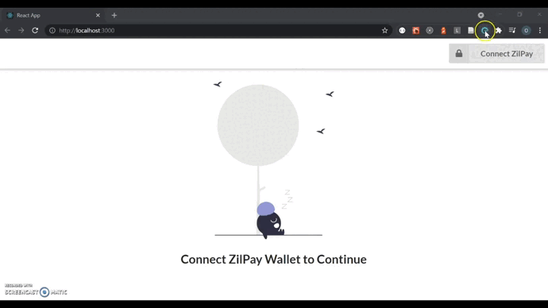

# Land ownership registry on Zilliqa Blockchain

This project was created as an example to demonstrate how to write smart contracts on [Zilliqa](https://www.zilliqa.com/) blockchain using Scilla, deploy to the Tesnet and to call the contract from a React application.


* The dApp allows a **registrar** to register/save property information to the blockchain and to transfer the ownership to a buyer. The registrar has to be specified during the contract deployment.  

* After the ownership is transferred, only the current owner or the registrar is allowed to transfer the property to another owner (owners are identified by the wallet address)

<br>


## Running the application

1. Deploy the [LandOwnership.scilla](/LandOwnership.scilla) to the Testnet using your wallet. The contract initialization parameter **registrar** accepts a wallet address that will act as the authorized user to add/transfer property.


2. In the [constants.js](/src/constants.js) file, change the **CONTRACT_ADDRESS** to the address of your deployed smart contract.

3. Install the dependencies

```
npm install
```

4. Start the development server

```
npm start
```

## Demo

<p align="center">
  
</p>


